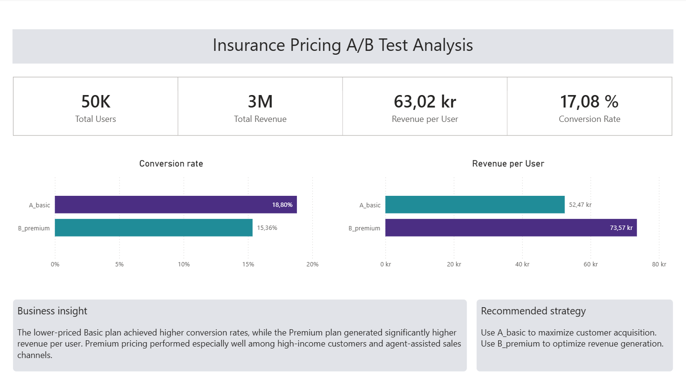
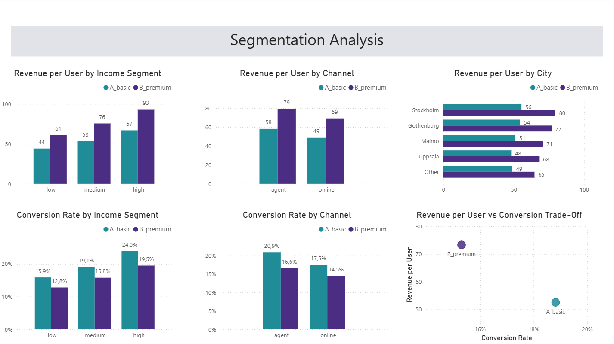

# Insurance Pricing A/B Test Analysis

## Project Overview

This project simulates a pricing A/B test for an insurance company to evaluate how pricing impacts customer conversion and revenue performance.

Two pricing strategies were tested:

- **A_basic** → lower-priced insurance plan
- **B_premium** → higher-priced insurance plan

The objective was to analyze the trade-off between maximizing customer conversion and maximizing revenue per user.

The project follows a complete analytics workflow including:
- synthetic data generation in Python
- SQL data cleaning and analysis
- statistical significance testing
- Power BI dashboard development


# Business Goal

Insurance companies often face a pricing trade-off:

- lower pricing can increase customer acquisition
- higher pricing can improve revenue generation

This project aimed to answer the following questions:

- Does lower pricing significantly improve conversion rates?
- Does premium pricing generate enough additional revenue to justify lower conversion?
- Which customer segments respond best to premium pricing?
- Are the observed differences statistically significant?


# Approach

The project was completed in four main stages.

### 1. Data Generation (Python)

A synthetic insurance dataset was created to simulate realistic customer behavior and pricing experiments.

The dataset included:
- demographic information
- acquisition channels
- city segmentation
- customer risk profiles
- conversion outcomes
- revenue generation

Intentional data-quality issues were also introduced to simulate real-world raw data.

### 2. Data Cleaning (SQL)

The raw dataset was cleaned and standardized in SQL.

Cleaning steps included:
- removing duplicate user IDs using `ROW_NUMBER()`
- standardizing categorical fields using `TRIM()` and `LOWER()`
- fixing inconsistent city/channel values
- handling missing values
- filtering unrealistic age values
- removing invalid risk scores

A clean analytical table (`insurance_clean`) was created for downstream analysis.

### 3. A/B Test Analysis (SQL)

SQL analysis focused on:
- conversion rate comparison
- total revenue comparison
- revenue per user comparison
- customer segmentation analysis

Segment-level analysis was performed by:
- income level
- acquisition channel
- city

### 4. Statistical Significance Testing (Python)

A chi-square test was performed using `scipy.stats.chi2_contingency()` to validate whether the conversion-rate difference between pricing groups was statistically significant.


### Result

- **Chi-square = 103.88**
- **p-value < 0.001**

This confirmed that pricing had a statistically significant impact on customer behavior.


# Key Findings

## Pricing Trade-off

The lower-priced **A_basic** plan achieved a higher conversion rate:

- **A_basic:** 18.8%
- **B_premium:** 15.4%

However, the Premium plan generated substantially higher revenue per user:

- **A_basic:** 52.47
- **B_premium:** 73.57

This demonstrates the trade-off between customer acquisition and revenue optimization.

## Income-Level Segmentation

Premium pricing generated higher revenue per user across all income groups, with the strongest performance among high-income customers.

This suggests that higher-income users are more receptive to premium insurance pricing.

## Channel Performance

The Premium plan performed especially well in the **agent-assisted sales channel**.

Customers acquired through agents generated significantly higher revenue per user compared to online-only acquisition, suggesting that premium insurance products benefit from human-led sales interactions.

## Geographic Performance

Stockholm showed the strongest Premium revenue performance among major city segments.

This suggests that metropolitan markets may be more receptive to premium insurance products.


## Statistical Significance

The difference in conversion rates between pricing groups was statistically significant (**p < 0.001**), indicating that the pricing strategy had a measurable impact on customer conversion behavior.


# Business Recommendations

## If the business prioritizes customer acquisition

Use the lower-priced **A_basic** plan to maximize conversion rates.

## If the business prioritizes revenue optimization

Focus on the **B_premium** pricing strategy, particularly among:
- high-income customers
- agent-assisted sales channels
- metropolitan markets such as Stockholm

A segmented pricing strategy may provide the strongest balance between growth and profitability.


# Power BI Dashboard

The Power BI dashboard was designed with two pages.

## Dashboard Preview

### Executive Dashboard


### Analyst Dashboard


## Executive Dashboard

Business-focused overview including:
- conversion rate
- total revenue
- revenue per user
- A/B comparison KPIs
- pricing trade-off summary

## Analyst Dashboard

Deeper segmentation analysis including:
- income-level performance
- channel performance
- geographic performance
- conversion vs revenue comparisons


# Dataset

The dataset was synthetically generated in Python to simulate a realistic insurance pricing experiment.

## Dataset Characteristics

- 50,000 simulated users
- pricing A/B test structure
- customer demographics
- acquisition channels
- revenue outcomes
- intentionally introduced raw-data inconsistencies

## Key Features

- duplicate records
- inconsistent text formatting
- missing values
- unrealistic numerical values

These issues were intentionally added to create a realistic SQL cleaning workflow.


# Tools Used

- **Python** → synthetic data generation & statistical testing
- **SQL (MySQL)** → data cleaning & A/B analysis
- **Power BI** → dashboarding & visualization
- **SciPy** → chi-square significance testing


# Project Structure

```text
insurance-pricing-ab-test/
│
├── data/
│   └── insurance_pricing_ab_test_raw.csv
│
├── sql/
│   ├── insurance_pricing_ab_test_cleaning
│   └── insurance_pricing_ab_test_analysis
│
├── python/
│   ├── ABtesting_datageneration.py
│   └── chi-square-test.py
│
├── powerbi/
│   └── insurance_ab_test_dashboard.pbix
│
├── images/
│   ├── executive-summary.png
│   └── analyst-dashboard.png
│
└── README.md
